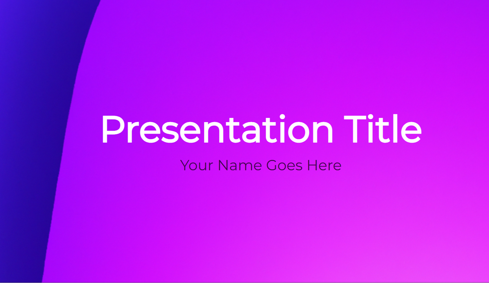
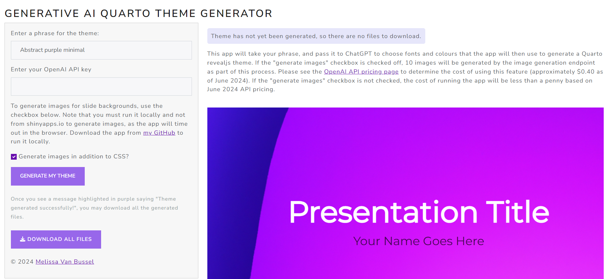
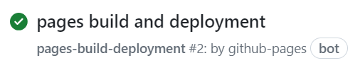
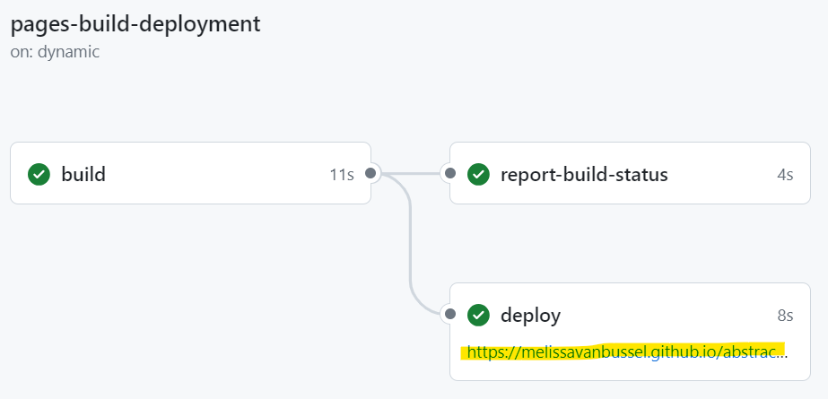

# Generative AI Quarto revealjs theme generator

This Shiny app takes a user-inputted phrase (e.g., "Abstract purple minimal") and generates a Quarto revealjs theme. 

## How it works

The app uses the user-inputted phrase and asks ChatGPT to choose a relevant colour scheme and font. There's also an option to generate slide background images, if the app is run locally. 

The app then generates all necessary files: 

* `slides.qmd`
* `custom.scss`
* All generated slide background images, if applicable
* `.gitignore`
* `_quarto.yml`
* A project `README.md` with usage and modification instructions
* A configuration file for GitHub Actions and GitHub Pages -- just follow the steps below, push the repo, and the slides will be hosted automatically on GitHub Pages and automatically updated any time a commit is made.

## How to use this app

**Pre-requisites:** You will need R and RStudio installed (or if not RStudio, another means of creating `.Rproj` files). To be able to push to GitHub Pages, you will need Git installed, and you will need to have a GitHub account. 

### Step 1: Generating the files

There are two ways to use the Shiny app to generate the files. Option A is to run it from [shinyapps.io](https://melissavanbussel.shinyapps.io/quarto_theme_generator/), and Option B is to run it locally. In order to generate images for the slide backgrounds, Option B must be selected (this is because generating the images takes several minutes, and the app will timeout in the browser mid-way through generating the images). 

#### Option A: Running the app from shinyapps.io 

* Navigate to [https://melissavanbussel.shinyapps.io/quarto_theme_generator/](https://melissavanbussel.shinyapps.io/quarto_theme_generator/).
* Enter a phrase for the theme you would like to generate (e.g., "Abstract purple minimal").
* Enter your OpenAI API key (see [this page](https://openai.com/index/openai-api/) to obtain one).
* Ensure that the "Generate images in addition to CSS?" checkbox is **unchecked**. Leaving it checked (when running from shinyapps.io) will result in the app timing out and not generating the files. 
* Click on the "Generate my theme" button.
* Notice that the purple text at the top right of the app will initially say "Theme has not yet been generated, so there are no files to download."
* Once the files have finished generating, the purple text will change to "Theme generated successfully! You may now use the download button.".
* You may now click the "Download all files" button and save the ZIP folder on your computer. 

#### Option B: Running the app locally

* Download [this](https://github.com/melissavanbussel/theme-generator) repository.
* Ensure all the packages listed at the top of the `ui.R` and `server.R` files are installed (use `install.packages` if not). Note that the project uses `renv`, so packages will be installed at the project-level.
* Run the Shiny app (e.g., open `server.R` in RStudio and click the "Run App" button).
* Follow the same steps as for Option A, but you may check the "Generate images in addition to CSS?" checkbox, if you wish. 

### Step 2: Pushing to GitHub Pages 

* Unzip the zip folder that was created. 
* In RStudio, use `New project > Existing directory` to create an R project. When asked to select a folder, select the folder that contains `slides.qmd` and the other generated files.
* Run `renv::init()`. This is necessary to create the `renv.lock` file that GitHub Pages will use to install the required R packages for the project. 
* Push the folder to GitHub. There are many ways to do this, but the steps I usually take are: Create a new (public, not private) repository on GitHub and leave the default configuration options (i.e., do not create a `README.md` or `.gitignore`), then use Git Bash to push the folder to that repository on GitHub. 
* On GitHub, add a `gh-pages` branch and ensure that `gh-pages` is selected under `Settings > Pages > Deploy from a branch`.
* A few minutes later, you should be able to view the slides by going to `Actions` and clicking on `pages build and deployment`, followed by clicking on the link that is shown under the `deploy` workflow run.

### Step 3: Modifying the slide content

* Edit the `slides.qmd` file to add your content.
* Customize the `custom.scss` file to change style elements in the theme. 
* If any new R packages are used in the project, they must be tracked using `renv` (otherwise the slides will not work properly on GitHub Pages). If you have added new packages to the project, run `renv::snapshot()` to update the `renv.lock` file. To check if the `renv.lock` file is currently up-to-date and has all of the necessary information, you can run `renv::status()`. 

**Please note:** The filename of `slides.qmd` must **not** be changed, unless the `.github/workflows/publish.yml` file is also changed accordingly. I recommend leaving the file named as `slides.qmd` unless you have a lot of experience with GitHub Actions and feel comfortable troubleshooting.

### Step 4 (optional): Rendering the slides locally

Please note that the slides never need to be rendered locally in order for them to work properly on GitHub Pages. If you would like to render them locally, though, the following step is necessary: 

* When rendering locally, make a copy of all images in the `images` folder and put them into `slides_files/libs/revealjs/dist/theme`. 